---

## 🖼️ Application Screenshots

### 🏠 Informational Pages
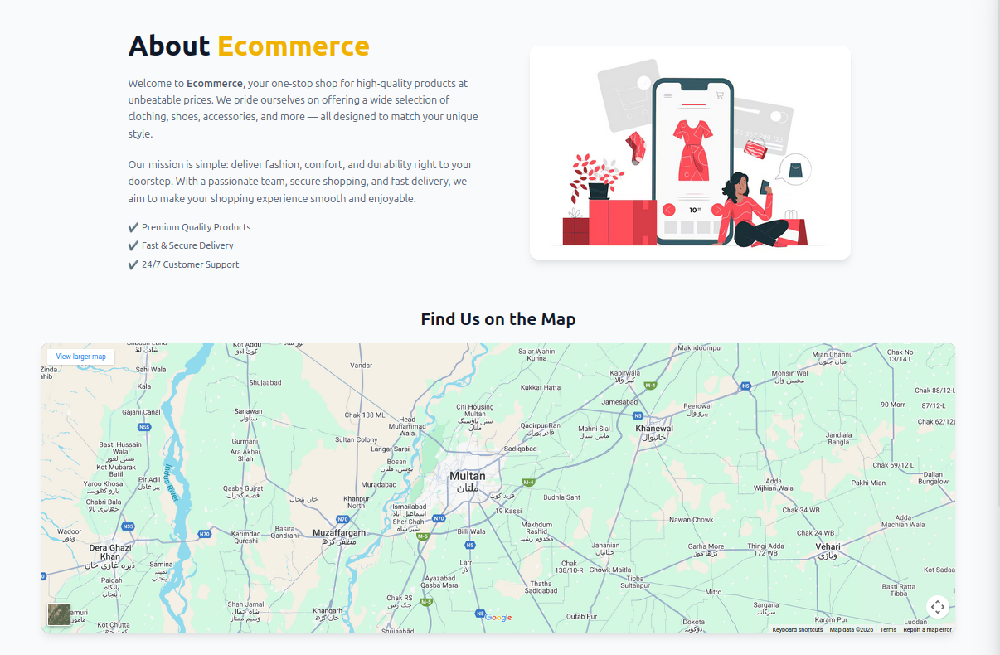
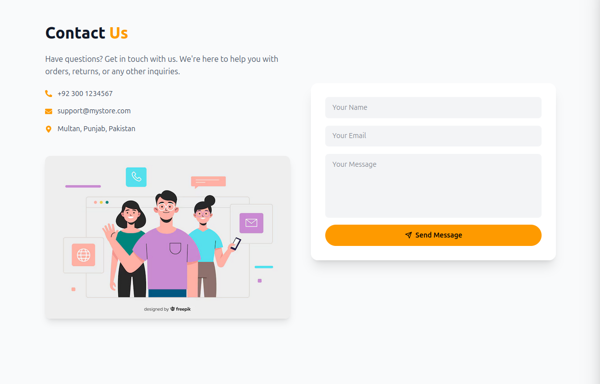
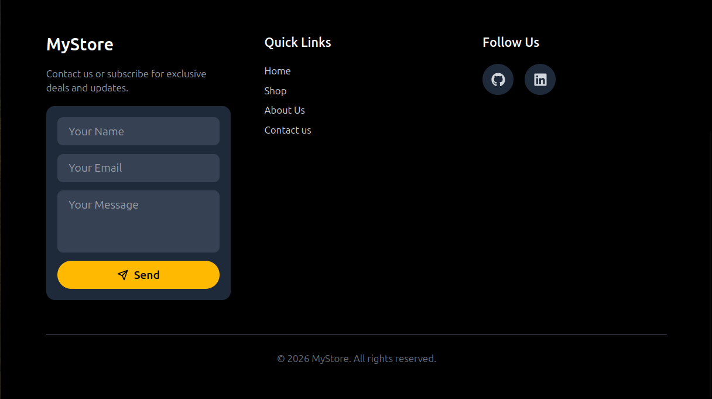

---

### 🛍️ Product & Shopping Flow
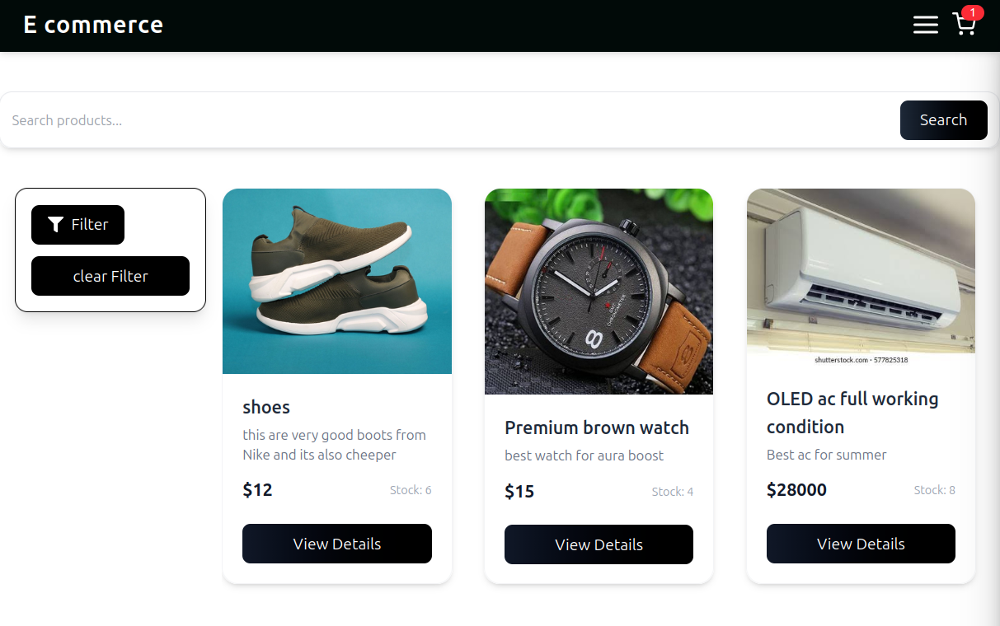
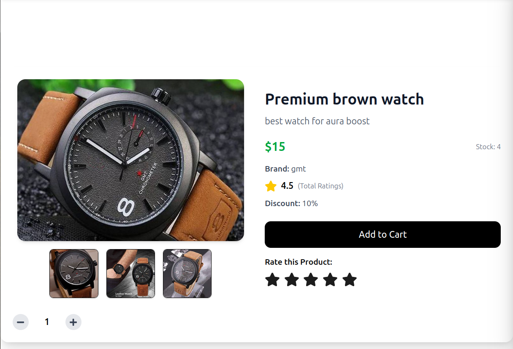
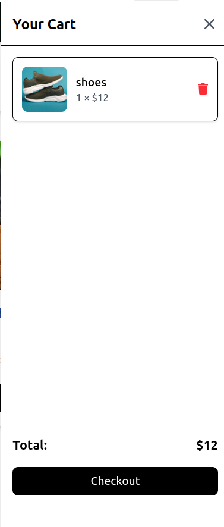
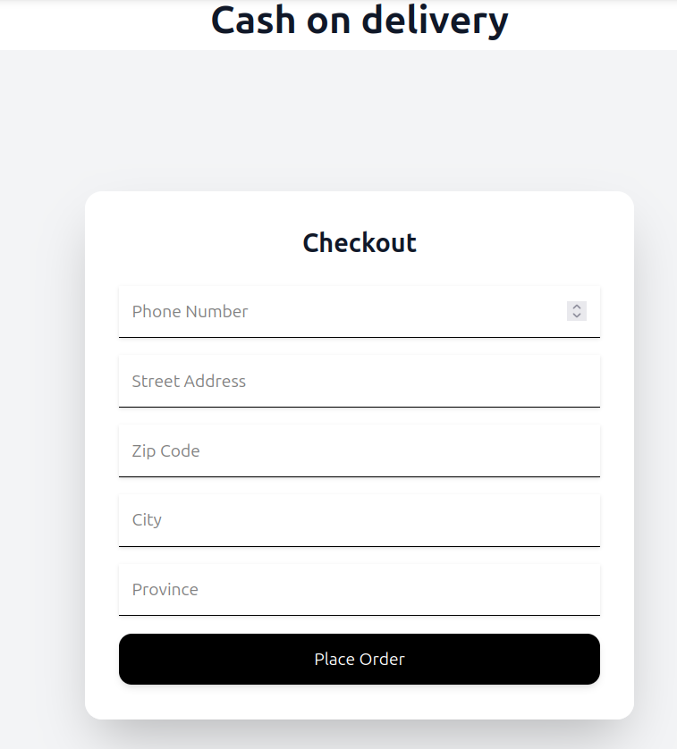

---

### 🛠️ Admin Dashboard & Analytics

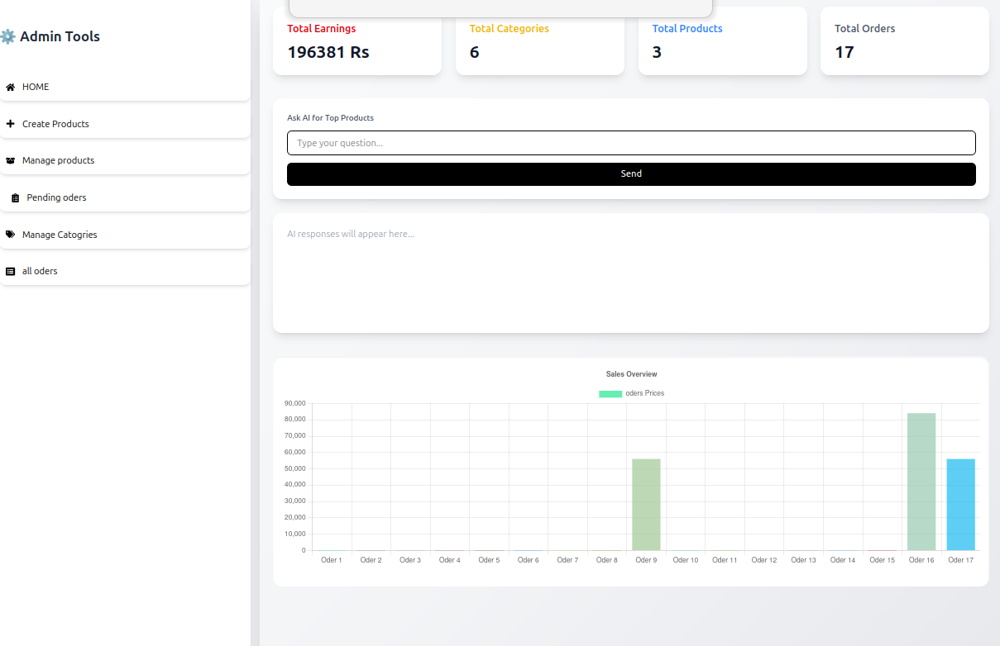

---

### 📦 Product Management (Admin)
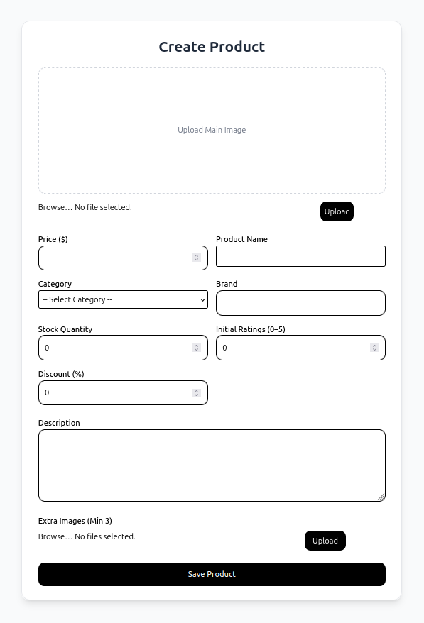
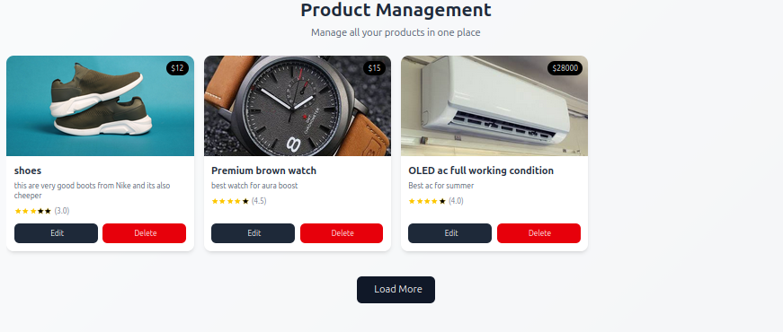
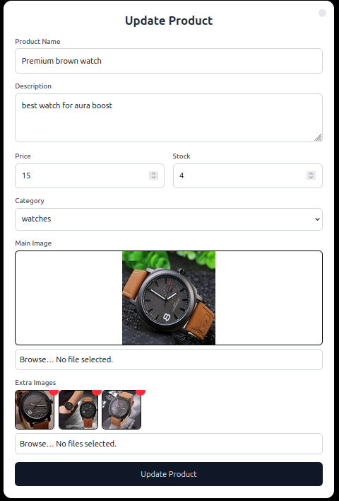

---

### 🗂️ Category & Order Management
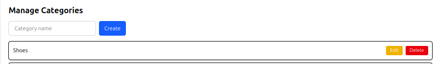
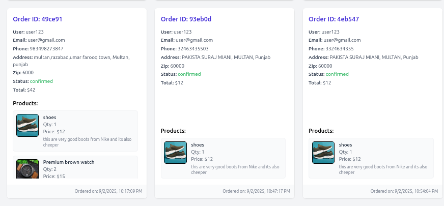

---

## ⚙️ Environment Variables (Backend)

Create a `.env` file inside the `backend/` folder:

```env
MONGO_URL=your_mongodb_connection_string
JWT_SECRET=your_jwt_secret
GOOGLE_API_KEY=your_google_api_key_if_used
▶️ Run Locally (Development)
Backend
cd backend
npm install
node server.js


Backend runs on: http://localhost:3000

Frontend
cd frontend
npm install
npm run dev


Frontend runs on: http://localhost:5173

🏗️ Build for Production
Frontend
npm run build

Backend

Deploy using Vercel, VPS, PM2, or Docker.